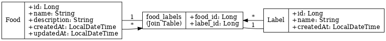

# 🍽️ Food Labeling GraphQL API

A Spring Boot + GraphQL + PostgreSQL service to manage foods and their associated labels (e.g., "Vegan", "Italian"). Supports creating, updating, deleting, and querying foods and labels.

---

## 🛠 Tech Stack

- Java 17+
- Spring Boot 3+
- Spring GraphQL
- PostgreSQL (via Docker)
- JPA + Hibernate
- Maven
- Lombok

---

## 🚀 Getting Started

### 1. Clone the Repository

```bash
git clone https://github.com/your-username/food-labeling-api.git
cd food-labeling-api
```

### 2. Start PostgreSQL using Docker

Make sure Docker is installed and running, then:

```bash
docker-compose up -d
```

> The service will run at `localhost:5432`  
> Default DB name: `food_labeling_db`  
> Username: `postgres`  
> Password: `postgres`

---

### 3. Configure the Application

Update `src/main/resources/application.yaml` if needed:

```yaml
spring:
  datasource:
    url: jdbc:postgresql://localhost:5432/food_labeling_db
    username: postgres
    password: postgres
  jpa:
    hibernate:
      ddl-auto: update
    show-sql: true
```

---

### 4. Build and Run the Project

#### From Terminal:
```bash
./mvnw clean spring-boot:run
```

#### Or from your IDE:
Run `FoodLabelApplication.java`

---

## 🔍 Access GraphQL Playground

Open in browser:

```
http://localhost:8080/graphiql
```

---

## 📦 Example GraphQL Queries

### Query all labels with food count
```graphql
query {
  allLabelsWithCount {
    id
    name
    count
  }
}
```

### Create a new label
```graphql
mutation {
  createLabel(input: { name: "Vegan" }) {
    id
    name
    count
  }
}
```

### Create a food
```graphql
mutation {
  createFood(input: {
    name: "Tofu Bowl"
    description: "Vegan delight"
    labelNames: ["Vegan"]
  }) {
    id
    name
    description
    labels {
      name
    }
  }
}
```

---

## ✅ Run Unit Tests

```bash
./mvnw test
```

---

## 📄 Notes

- Foods and labels are in a many-to-many relationship.
- Label names must exist before associating them with foods.
- Name fields are limited to 20 characters.

---

## 🧼 Stop Services

```bash
docker-compose down
```

---


---

## 📊 ER Diagram



## 🔮 Future Scope

Here are a few ways this project can be extended:

- ✅ **Authentication & Authorization**  
  Integrate Spring Security or JWT to allow user-level access and ownership of food/label data.

- 📈 **Analytics and Usage Tracking**  
  Add metrics to track most-used labels or food popularity over time.

- 🗃️ **Label Categories / Hierarchy**  
  Allow labels to be grouped (e.g., Dietary → Vegan, Gluten-Free) using parent-child relationships.

- 📤 **Bulk Upload via CSV/JSON**  
  Enable admins to upload large batches of food and label data via file upload.

- 🌐 **Internationalization (i18n)**  
  Add support for multilingual label and food names and descriptions.

- 🔄 **Soft Deletes & Audit Logs**  
  Track who modified or deleted a food/label, and allow restoring deleted items.

- 📦 **Dockerized Full Stack**  
  Add a front-end (React/Vue) and package everything into a full-stack Docker Compose setup.


## 📄 License

MIT © YourName
